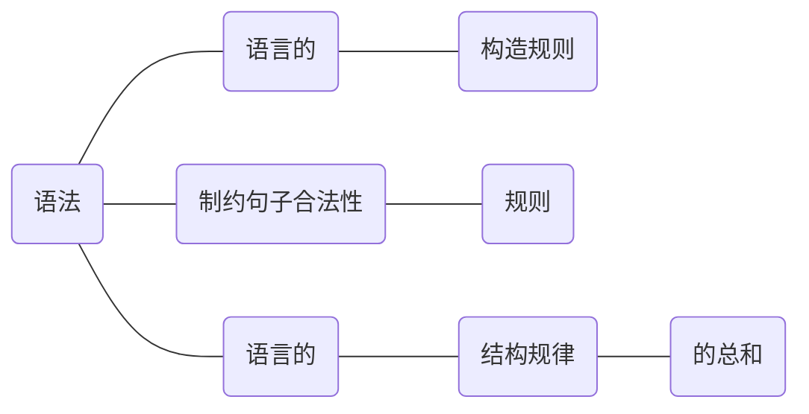
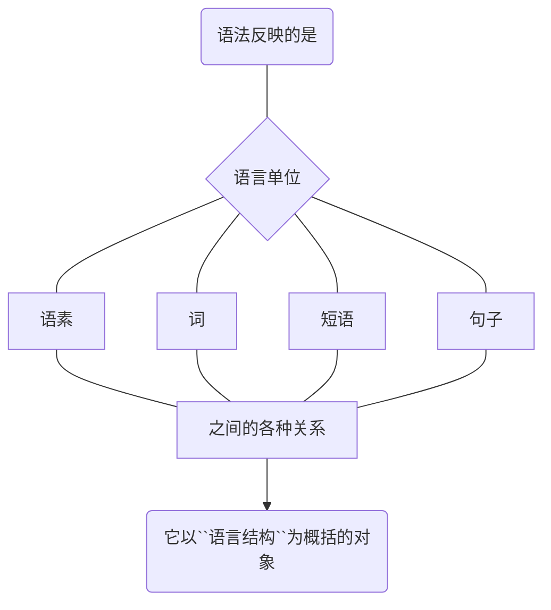
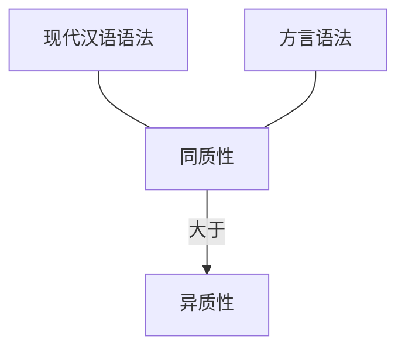
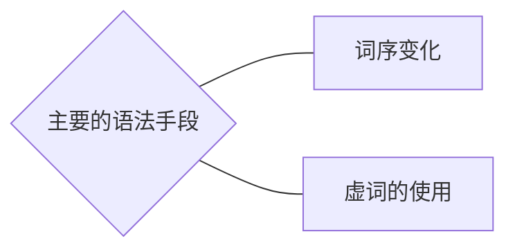
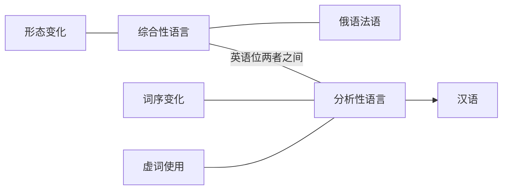
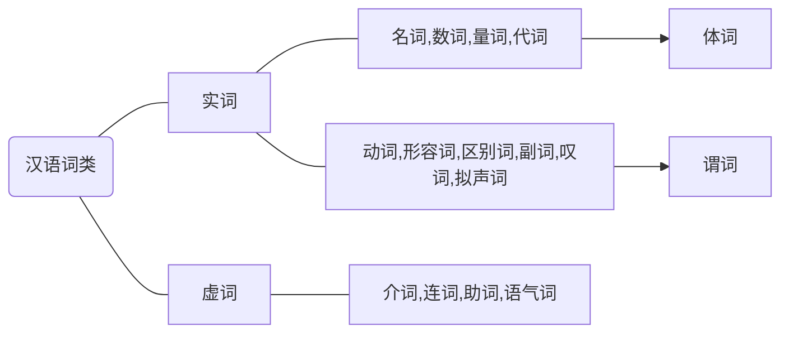

---
layout: post
title: 【笔记】现代汉语
date: 2020-03-29
categories: blog
tags: [学习笔记,语法,现代汉语]
description: 文章。
mermaid: true
catalog: true
Meting: true
author: "嚴與渿"
mserver: "netease"
mtype: "playlist"
mid: "5029678052"
mloop: "none"
murl:
mautoplay: true
mtheme: #b7daff
morder: random
---  
`200329/——待完` [`学习笔记`](../../../../../archive/?tag=学习笔记)   [`语法`](../../../../../archive/?tag=语法)  [`现代汉语`](../../../../../archive/?tag=现代汉语)  

---    
#### 目录
{:.no_toc}

*  目录  
{:toc}
--- 

### **5.1 什么是语法**

#### 语法（一）【广义】
>语法的涵义  

  
语法是语言中由小的音义结合体组合成大的音义结合体，所依据的一套规则。  

  
* * *

由音义结合体大小不同可定出一些研究的单位（语素、词、句子、短语）。  

* * *
#### 语法学【二】
>语法学是——语法学家——自觉地——对语言的——结构规律——加以研究——的结果

**可以从不同层面分析语言**

1. 分析语言中`【词与词】`之间的的关系——`句法学（语法学）`
2. 分析`【词与物】`的关系（词对应的现实世界）——`语义学`
3. 分析`【词与人】`的关系（语言的使用者）——`语用学`

* * *
#### 现代汉语语法与方言语法同异
>两者语法同质性大于异质性  

>但细节上存在差别

* 如：粤方言——有很多【状语后置】
* 如：吴方言——“写写好”“削削尖”等

* * *
#### 古现汉语语法同异

在汉语的——【语音、词汇、语法】中——`语法变化最慢`
此外古与现有较大的  `同质性`

* * *
>但也有语法现象的不同

如：  
古：时不`我待`  
现：时不`待我`  
否定句代词宾语前置于动词【今已无】   
  
* * *
现代汉语中的：  
“了（完成）”“着（进行）”“过（过去）”  
经过长时间的`功能虚化`已经成为`体的标记`  
从古代汉语的`实义动词`  变成——无法脱离的依附成分（动态助词）【成为语法手段`（词语的语法化）`】  

* * *
####  现代汉语的语法手段与不同语言之间的比较
像“俄”“法”等`综合性语言`  
在——词的形态上有`形式标记`  
这些语言的“语法”“词法（构词法）”占很大比重  
  
* * *
>汉语属于`分析性语言`  
  

* * *
#### 语法手段概念

  
* * *  
### **5.2现代汉语的特点**
>一般认为，汉语语法具有这样的特点：不依赖于严格意义的形态变化，而主要借助于语序、虚词等语法手段来表示语法关系和语法意义。  
  
##### （一）语序的变化对语法结构和语法意义有重大影响。  
* 语序不同，则结构不同：
    * 我们别吃-别吃我们
    * 前方吃紧-后方紧吃
* 语序不同，则语义不同：
    * 这件事不都是我的错-这件事都不是我的错
* 语序改变，导致结构、语义都改变：
    * 客人来了-来了客人（前者在心目中有特定的对象，后者无）

#####  （二）虚词的运用对语法结构和语法意义有重要作用。  
* 虚词的有无影响结构关系、语义关系：
    * 小杨师傅-小杨的师傅
* 虚词的有无导致语义变化：
    * 狐狸尾巴-狐狸的尾巴
    * 半斤苹果-半斤的苹果
* 虚词的有无会导致语用意义的改变：
    * 我爸爸-我的爸爸

##### （三）汉语词类跟句法成分之间不存在简单的一一对应的关系。  
* 形态丰富的语言，词类与句子成分之间一般存在比较整齐的对应关系。如英语的名词一般充当主语、宾语；动词充当谓语；形容词充当定语；副词充当状语。
* 汉语的词类与句子成分一般没有这种整齐的一一对应关系，一种词类（除副词外）可以作多种句法成分。
    * 明天`星期天`(名词做谓语)
    * 我们`学习`语法（动词作谓语）；要重视`学习`（动词作宾语）；`学习`很重要（动词作主语）。

##### （四）短语的结构跟句子的结构、词的结构基本一致  
* 汉语短语结构与句子结构基本一致
* 汉语的一个自由短语，加上一定的`语调`，即成为一个句子。反过来，句子去掉`语调`，即成为短语。

**短语与句子**  
短语可变为句子，句子也可变为短语（语调的有无）  
>你走——>你走！（短语变句子）  
>他希望你走<——你走？(句子变短语）  
    
**短语和复合词**  
>`短语与复合词的结构大致上是一致的`  ，因为汉语的复合词主要是从临时组合的短语发展而来的，有时候`短语和词的界限比较模糊。`  
  
如：结`（了两次)`婚、游`(了一小时)`泳、提`（不）`  高、改正、降低等。【都为动宾结构，合时为词，分时为短语】
  
* * *  
### **5.3 现代汉语词类**  
#### （一）词类的定义  
>词类：词的语法类别，是按词的语法功能上的差异分出的类。不同的词类在形态、功能、意义等方面有自身的特点。
    
词类是语法分析的基础之一，有了词类概念，就可以把无穷的组合抽象成为数不多的抽象结构，如：  
  
* “名词+名词”：今天晴天，青春岁月；
* “动词+名词"：回忆过去，学习方法；
* “名词+动词”：春天到来，图书出版。
    
####  （二）现代汉语词类的分类标准  
  
##### 参考标准：意义  
传统语法对词类的定义常从意义出发，如：名词是表示事物的词；动词是表示动作、变化、状态的词；形容词是表示事物性质的词。  
意义在划分词类时，给我们提供了`直感`，有一定的参考作用。  
  
* * *  
但是，意义在划分词类时的`局限`也是明显的，最明显的表现是：意义“同类”，语法的类却 `不一定相同`。例如：  
  
* 忽然（副词）-突然（形容词）【刚刚突然】、战斗(动词)-战争(名词)、刚才（名词）-刚刚（副词）  
  
* * *  
##### 辅助标准：形态  
汉语中有些成分被认为具有形态的性质，这些被看作形态的成分，在划分汉语词类的过程中有一定的作用，但是，汉语的所谓形态因为往往对一类词的内部`缺少普遍性和强制性`，而相对于另一类词又`缺少绝对的排他性`。  
因此，这些形态在划分汉语词类时只可作为`辅助标准`，如：  

* （一）“们"
    * 可称呼“老师们”“朋友们”，却不能说“黑板们”。以`们`等作为形态区分词类“名词”的标准是不可靠的，只能当作辅助标准。
* （二）“着、了、过"
    * 这三者被认为是汉语动词的形态标记，但并不是所有的动词都可以加“着、了、过"，有时名词也可以加“着、了、过"，如：大姑娘了。
* （三）重叠
    * 一般认为动词可以重叠，但并非所有的动词都可以重叠，而且也有一些其他词类可用于这种形态，如：“家家”“个个”“村村”等。
  
* * *  
`这一类词对同一类词缺乏普遍性，没有强制性`  
    
* * *  
##### 主要标准：功能(作用)  
一般认为，`汉语词类划分的主要依据是词的语法功能`：所谓语法功能，即词的组合能力，即能够跟哪些词组合，不能跟哪些词组合；可以充当什么句法成分。  
  
* （1）一个词能否与其他词组合成短语，以什么顺序组合、组合以后表示什么关系；
    * 如：可以说`很好`，却不能说`很同学`
* （2）一个词作句法成分的能力：主语、谓语、宾语、定语、状语、补语，经常作哪些成分，不能作哪些成分。
    * 如：名词常作主语、宾语；动词常作谓语
  
* * *  
#### (三)现代汉语词类系统  
* 在这个表中，先分成实词和虚词两大类，实词能充当句法成份，`虚词则不能充当句法成分`。
* 在实词中，又因为动词、形容词常作谓语，所以又合称为`谓词`，名词、数量词等因为表示“实体”，又合称为`体词`。
* 有的学者把`副词`归为实词，而另一些学者则归为虚词。

* * *    
### **5.4 现代汉语实词（一）**  
>`实词`是能单独充当句法成分及有词汇意义和语法意义的词，包括名词、动词、形容词、数词、量词、代词、区别词、副词、叹词、拟声词。  
>`虚词`：泛指没有完整意义的词汇，但有语法意义或功能。  
  
#### 实词和虚词的区别：  
* 一、是否`成句`
    * 他学习好不好？——好。
    * 谁来了？——他。
    * 你去吗？——不。
* 二、是否`定位`
    * 虚词一般是定位的，如“了”总是出现在实词之后。
* 三、能否`相互组合`
    * 实词可以相互组合，虚词不行
* 四、是否`开放`
    * 实词是开放类，而虚词是封闭类（实词能够无限增加）
* 五、使用`频率`的高低
    * 虚词的使用频率高，如“的"被认为是出现频率最高的词。
  
* * *  
#### （一）名词  
名词的语法特点：
* （一）大多可以`受数量短语修饰`：一个人一张纸；
* （二）主要充当主语、宾语和定语，除少数名词外，一般不作状语（历史地看问题）；
* （三）`不能`受“不”的修饰。（像不人不鬼等是固定短语，不能类推）
    
* * *  
#### （二）动词
动词的主要语法特点是：
* （一）主要作`谓语`
* （二）`能`受“不”修饰：不吃，不去，不喜欢
* （三）有些动词可以`重叠`：走走，研究研究
* （四）有些动词可以带`“了”、“着”或“过"`（并非全部，上同）
>在语法研究中，动词应该是最复杂也是最重要的词类，以不同的标准为依据，动词可以分出不同小类。
    
##### （一）动词的小类：及物动词与不及物动词  
>按能不能带`宾语`，动词可以分为及物动词和不及物动词
  
* 不及物动词：工作休息迟到；
* 及物动词：吃喝进行认为。
    
##### （二）动词的小类：语义类  
>按照动词的`意义`并参考该动词的`功能`，常见的有如下一些动词小类：
  
* （1）动作动词：喝，跑，研究；
* （2）使令动词：让，叫，请，要求；
* （3）心理动词：想，恨，相信；
* （4）存现动词：有，在。
* （5）趋向动词：来，去，上来，下去；
* （6）能愿动词：能，会，可以；
* （7）判断动词：是，姓，叫，等于；
* （8）形式动词：进行，加以。
    
##### （三）动词的小类：情状分类  

| 静态 |  |  |  |  |  |
| --- | --- | --- | --- | --- | --- |
|  属性关系：| 是 | 姓 |等于|标志着 |  |
|  心理感觉 ：| 知道 |相信  |抱歉  | 怕 |  |
|姿势 ：  |  站|  坐| 躺 | 蹲 |住|
|位置 ：  | 戴 | 拿 |挂 | 吊 |  |
  
| 动态 |  |  |  |  |
| --- | --- | --- | --- | --- |
|动作-瞬间：  | 踢 |砍  |碰  |咳嗽  |
|动作-持续：|  看|吃  | 想 | 洗澡 |
| 结果-瞬间：| 死 |爆炸  |醒  |见  |
| 结果-持续： | 变好 | 长大 | 走进 |  |
  
* * *    

