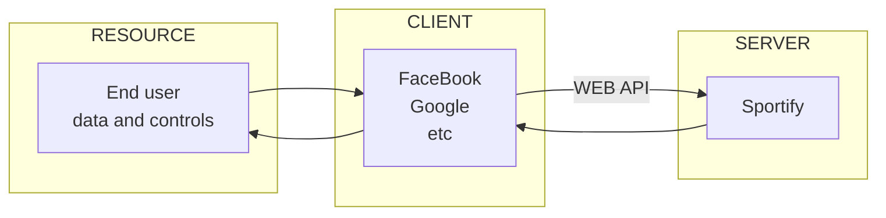



# REST API

## API
> Application Programing Interface
{:.comment}  
- 두 개의 시스템이 상호 작용하기 위한 인터페이스
- 데이터를 주고 받는 인터페이스
- API라하면 보통 REST API를 지칭함

## WEB API

{:width='500px'}  
*http 프로토콜을 사용하는 REST API 기반으로 구축한 웹사이트*

# API 접근 권한

## Authentication VS Authorization
- Authentication : Identity(정체)가 맞는지 자격 증명
- Authorization: API를 통한 어떤 액션에 대한 권한 설정

## API Key
- API 호출할 때 Request URL 또는 Request 헤더에 포함시키는 긴 스트링
- API Key가 없으면 API의 사용이 불가능

1. URL 방식
   - Request URL에 Key String을 포함시켜 호출
   - eg. 구글맵 &rarr; https://maps.googleapis.com/maps/api/directions/json?origin=Disneyland&destination=Universal+Studios +Hollywood&key=**YOUR_API_KEY**{:.font-blue}
1. Header 방식 : BasicAuth
   - username:password와 같은 credential을 base64로 인코딩해서 Request Header에 포함시켜 호출

## OAuth 2.0
- 페이스북이나 구글 계정으로 인증하는 방식 등의 경우

# API 구조
{:width='340px'}

## Endpoint
- API를 요청하는 포인트의 값  
- Resource를 Access하는 경로/방법

## Method
- 자원 접근에 허용된 범위

|Method|Type|내용|
|:--:|:--:|--|
|GET|SELECT|해당 리소스를 조회하고 정보를 가져온다|
|HEAD|SELECT|GET 방식과 동일. 단, 응답코드와 HEAD만 가져온다 &rarr; API 작동 여부 확인용|
|POST|INSERT|요청된 리소스를 생성한다|
|PUT|UPDATE|요청된 리소스를 업데이트한다|
|DELETE|DELETE|요청된 리소스를 삭제한다|

## Parameter
- Endpoint를 통해 Request할 때 함께 전달하는 값

|Type|내용|예|
|:--:|--|--|
|Header|주로 Authorization 관련 정보 전달||
|Path|Query String(?, 물음표) 이전 Endpoint path 안에 포함되는 변수|{id}|
|Query String|Query String(?, 물음표) 이후 포함되는 변수|?country=SE&city=seoul|
|Request Body|주로 JSON 형태로 전달되며 POST method에 주로 사용|{cuntry:'SE', city:'seoul'}|

## Response Status Codes
- Web API uses the following response status codes, as defined in the [RFC 2616](https://www.ietf.org/rfc/rfc2616.txt) and [RFC 6585](https://www.ietf.org/rfc/rfc6585.txt)
  - 2XX : 정상 작동
  - 4XX ~ 5XX : 오류 발생

{:width='600px'}

# Spotify API
> **REF**  
> [Spotify Web API](https://developer.spotify.com/documentation/web-api/){:target='_blank'}  
> [Spotify 한국에서 가입하기](http://0.0.0.0:4000/etc/SpotifySignUp){:target='_blank'}

## API Doc
- Rate Limiting
- Response Status Code
- API ENDPOINT REFERENCE
  - 세부 API 정보 확인 가능 
  - eg. get an artist, get an artist's top tracks, etc  
    {:.border width='400px'}

## API App & 계정 생성
- [Dashboard](https://developer.spotify.com/dashboard/){:target='_blank'}

1. CREATE AN APP으로 신규 앱 생성  
{:.border width='400px'}

2. 정보 입력  
{:width='200px'}  

3. Client ID & Client Secret 확인  
{:width='400px'}  
   - Client ID : e351e56f4cc04714976ce9d82b22f18d
   - Client Secret : a8910dc7bd9b4753b02905a7fc84fc6c

> **REF**  
> 패스트캠퍼스 - 데이터 엔지니어 강의 / 한승수 강사