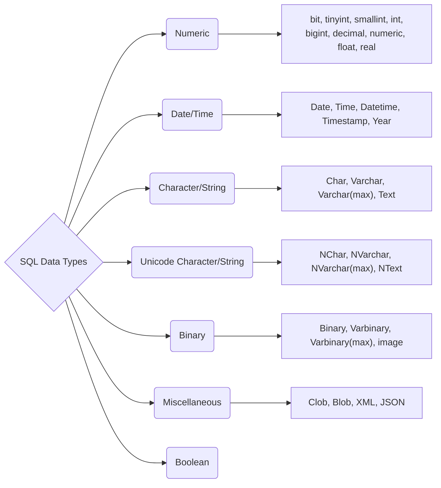



# SQL Data Types

## SQL Numeric Data Types

|Data Type|From|To|
|:--:|:--:|:--:|
|bit|0|1|
|tinyint|0|255|
|smallint|-32,768|32,767|
|**int**|-2,147,483,648|-2,147,483,647|
|bigint|-9,223,372,036,854,775,808|9,223,372,036,854,775,807|
|**decimal**|-10^38+1|10^38-1|
|numeric|-10^38+1|10^38-1|
|**float**|-1.79E + 308|1.79E + 308|
|real|-3.40E + 38|3.40E + 38|

## SQL Date and Time Data Types

|Data Type|Description|
|:--:|--|
|DATE|Stores date in the format **YYYY-MM-DD**|
|TIME|Stores time in the format **HH:MI:SS**|
|DATETIME|Stores date and time information in the format **YYYY-MM-DD HH:MI:SS**|
|TIMESTAMP|Stores number of seconds passed since the Unix epoch **('1971-01-01 00:00:00' UTC)**|
|YEAR|Stores year in 2 digit or 4 digit format. Range 1901 to 2155 in 4-digit format. Range 70 to 69, representing 1970 to 2069.|

## SQL Character and String Data Types
- 데이터 타입 및 길이는 데이터베이스마다 조금씩 다르므로 사용 시 각각 확인 필요
  
|Data Type|Description|
|:--:|--|
|CHAR|Fixed length with maximum length of 8,000 characters
|VARCHAR|Variable length storage with maximum length of 8,000 characters
|VARCHAR(max)|Variable length storage with provided max characters, not supported in MySQL
|TEXT|Variable length storage with maximum size of 2GB data

## SQL Unicode Character and String Data Types

|Data Type|Description|
|:--:|--|
|NCHAR|Fixed length with maximum length of 4,000 characters
|NVARCHAR|Variable length storage with maximum length of 4,000 characters
|NVARCHAR(max)|Variable length storage with provided max characters
|NTEXT|Variable length storage with maximum size of 1GB data

> **REF**  
> 패스트캠퍼스 - 데이터 엔지니어 강의 / 한승수 강사  
> [SQL Data Types](https://www.journaldev.com/16774/sql-data-types){:target='_blank'}