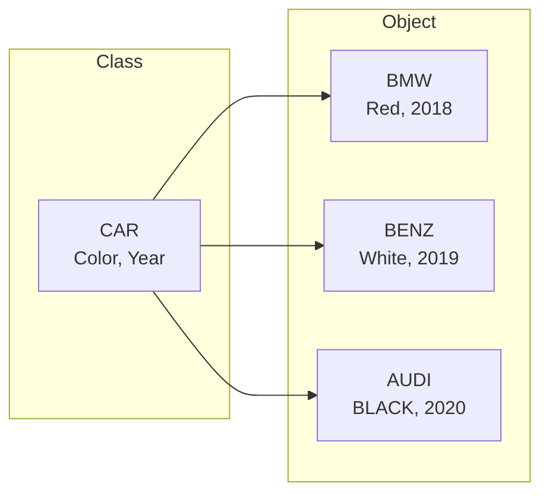
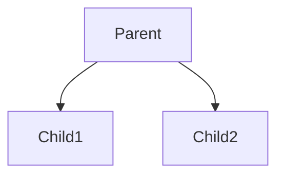

# Class vs Object



## Class
- 실세계의 것을 모델링하여 속성(attribute)와 동작(method)를 갖는 데이터 타입
- python에서의 string, int, list, dict.. 모두가 다 클래스로 존재
- 예를들어 학생이라는 클래스를 만든다면, 학생을 나타내는 속성과 학생이 행하는 행동을 함께 정의 할 수 있음
- 따라서, 다루고자 하는 데이터(변수) 와 데이터를 다루는 연산(함수)를 하나로 캡슐화(encapsulation)하여 클래스로 표현
- 모델링에서 중요시 하는 속성에 따라 클래스의 속성과 행동이 각각 달라짐

## Object
- 클래스로 생성되어 구체화된 객체(인스턴스)
- 파이썬의 모든 것(int, str, list..etc)은 객체(인스턴스)
- 실제로 class가 인스턴스화 되어 메모리에 상주하는 상태를 의미
- class가 빵틀이라면, object는 실제로 빵틀로 찍어낸 빵이라고 비유 가능

# class 선언
- 객체를 생성하기 위해서는 객체의 모체가 되는 클래스를 먼저 선언해야 함

### \_\_init__(self)
- 생성자, 클래스 인스턴스가 생성될 때 호출됨

### self
- self인자는 항상 첫 번째에 오며 자기 자신을 가리킴 : 기본적으로 항상 포함됨
- 이름이 꼭 self일 필요는 없지만, 관례적으로 self로 사용
- C++/C#, Java의 this와 같은 개념
- 생성자에서는 해당 클래스가 다루는 데이터를 정의 &rarr; 이 데이터를 멤버 변수(member variable) 또는 속성(attribute)라고 함

#### class의 정적 생성

```python
class Person():
    def __init__(self):
        print(self, 'is generated') # 객체 생성 시점 확인용
        self.name = 'Mike'
        self.age = 10

p1 = Person()
p2 = Person()
>> <__main__.Person object at 0x114ec9b90> is generated
>> <__main__.Person object at 0x114ec9d50> is generated

print(p1.name, p1.age)
>> Mike 10

p2.name='Kelly'
p2.age = 20
print(p2.name, p2.age)
>> Kelly 20
```
_&rarr; 0x114ec9b90, 0x114ec9d50 메모리 주소에 각각 할당된 Person의 객체 2개가 생성된 것을 확인 가능_

#### class 동적 생성
- 클래스의 속성을 파라미터로 받아서 생성
- selft는 항상 기본으로 포함
- 파라미터 기본값 정의도 가능

```python
class Person():
    def __init__(self, name, age=15):
        print(self, 'is generated')
        self.name = name
        self.age = age

p1 = Person('Bob', 20)
p2 = Person('Amy', 29)
p3 = Person('Aron')
>> <__main__.Person object at 0x10735bf90> is generated
>> <__main__.Person object at 0x10735be50> is generated
>> <__main__.Person object at 0x10735bf90> is generated

print(p1.name, p1.age)
print(p2.name, p2.age)
print(p3.name, p3.age)
>> Bob 20
>> Amy 29
>> Aron 15
```

# mehtod
> 멤버함수
{:.comment}  

`{obj}.{method}()`
- 해당 클래스의 object에서만 호출 가능

### instance method
- 객체로 호출 &rarr; 해당 객체에만 영향을 끼침
- 해당 객체의 속성에 대한 연산을 수행 &rarr; self 인자 필수

```python
class Counter:
    def __init__(self):
        self.num = 0

    def increment(self):
        self.num += 1
    
    def reset(self):
        self.num =0
    
    def print_value(self):
        print('Value:', self.num)

c1 = Counter()
c2 = Counter()

c1.print_value()
c1.increment()
c1.increment()
c1.increment()
c1.print_value()

c1.reset()
c1.print_value()
print('-'*10)

c2.print_value()

>>>
Value: 0
Value: 3
Value: 0
----------
Value: 0
```
_&rarr; method가 c1과 c2 객체 각각에 영향을 끼치는 것을 알 수 있다_

### static method  
> class method
{:.comment}

`@statismethod 함수 정의`

- class로 호출 &rarr; 클래스 멤버 변수만 변경 가능
- 자체 변수를 가질 필요가 없는 경우 사용 &rarr; self 인자 불필요

### instance method vs static method

1. instance method  
    ```python
    class Math:
        def add(self, a, b):
            return a + b
        def multiply(self, a, b):
            return a * b
        
    m = Math()
    m.add(2, 6)
    m.multiply(2,6)
    ```
2. static method  
    ```python
    class Math:
        @staticmethod
        def add( a, b):
            return a + b
        
        @staticmethod
        def multiply(a, b):
            return a * b
        
    Math.add(2, 6)
    Math.multiply(2,6)
    ```

# 클래스 상속
- 기존에 정의해 둔 클래스의 기능을 그대로 상속 가능
- 코드 재사용 : 기존 클래스에 기능 일부를 추가/변경하여 새로운 클래스를 정의
- 의미적으로 부모/자식 클래스 간에 is-a관계 성립 eg. Student is a Person
  - Parent, Super, Base class : 상속 받고자 하는 대상인 기존 클래스
  - Child, Sub, Derived class : 상속 받는 새로운 클래스
   


### class inheritance

- 부모 클래스 정의
    ```python
    class Person:
        def __init__(self, name, age):
            self.name = name
            self.age = age
            
        def eat(self, food):
            print('{}은 {}를 먹는다'.format(self.name, food))
            
        def sleep(self, minute):
            print('{}은 {}동안 잔다'.format(self.name, minute))
            
        def work(self, minute):
            print('{}은 {}동안 일한다'.format(self.name, minute))
    ```

- 자식 클래스에 상속
    ```python
    class Student(Person):
        def __init__(self, name, age):
            self.name = name
            self.age = age

    class Employee(Person):
        def __init__(self, name, age):
            self.name = name
            self.age = age
            
    Bob = Student('Bob', 25)
    Bob.eat('Beer')
    Bob.sleep(120)
    Bob.work(120)
    >> Bob은 Beer를 먹는다
    >> Bob은 120분동안 잔다
    >> Bob은 120분동안 일한다
    ```

### method override
- 부모 클래스의 method를 재정의(override) &rarr; **부모 클래스의 기능은 완전히 사라지게 됨**{:.font-blue}
- 하위 클래스(자식 클래스)의 인스턴스 호출 시 재정의된 메소드가 호출됨
- 자식 클래스에서 overriding (상기 부모 클래스 계속 사용)
    ```python
    class Student(Person):
        def __init__(self, name, age):
            self.name = name
            self.age = age
            
        def work(self, minute):
            print('{}은 {}분동안 공부한다'.format(self.name, minute))

    class Employee(Person):
        def __init__(self, name, age):
            self.name = name
            self.age = age
        
        def work(self, minute):
            print('{}은 {}분동안 업무를 한다'.format(self.name, minute))

    Bob = Student('Bob', 25)
    Bob.eat('Beer')
    Bob.sleep(120)
    Bob.work(120)

    Amy = Employee('Amy', 30)
    Amy.work(360)
    >> Bob은 Beer를 먹는다
    >> Bob은 120분동안 잔다
    >> Bob은 120분동안 공부한다
    >> Amy은 360분동안 업무를 한다
    ```

### super
- 하위 클래스(자식 클래스)에서 부모 클래스의 method를 호출할 때 사용
- 자식 클래스에서 부모 클래스의 기능 호출
    ```python
    class Employee(Person):
        def __init__(self, name, age):
            self.name = name
            self.age = age
        
        def work(self, minute):
            super().work(minute)
            print('{}은 {}분동안 업무를 했다'.format(self.name, minute))

    Amy = Employee('Amy', 30)
    Amy.work(360)
    >> Amy은 360분동안 일한다      # 부모 클래스 기능
    >> Amy은 360분동안 업무를 했다  # 자식 클래스 기능
    ```

### 정리
- class inheritance : 기본 상속. 부모 클래스를 그대로 가져다 사용
- method override : 부모 클래스의 기능 중 일부를 변경해서 사용
- super : 부모 클래스의 기능과 자식 클래스에서 변경/추가한 기능을 함께 사용

# special method
- \_\_로 시작 \_\_로 끝나는 특수 함수
- 해당 메쏘드들을 구현하면 커스텀 객체에 여러가지 파이썬 내장 함수나 연산자를 적용 가능
- 오버라이딩 가능한 함수 목록 참고
  - [Python Data Model](https://docs.python.org/3/reference/datamodel.html){:target='_blank'}
  - \_\_로 검색해서 찾아보자

### \_\_str__
`print(객체)`
- 객체를 출력해주는 내장 함수

1. 기본 객체를 출력하면 메모리 주소 등의 정보가 나온다
    ```python
    class Point:
        def __init__(self, x, y):
            self.x = x
            self.y = y
        
    p1 = Point(1, 2)
    p2 = Point(4, 7)

    print(p1)
    print(p2)
    >> <__main__.Point object at 0x1150d23d0>
    >> <__main__.Point object at 0x1150d2250>
    ```
1. 출력해주는 메소드를 따로 작성해본다
    ```python
    class Point:
        def __init__(self, x, y):
            self.x = x
            self.y = y
            
        def print_point(self):
            print('({}, {})'.format(self.x, self.y))
        
    p1 = Point(1, 2)
    p2 = Point(4, 7)

    print(p1)
    print(p2)
    >> <__main__.Point object at 0x11520bbd0>
    >> <__main__.Point object at 0x11520b3d0>

    p1.print_point()
    p2.print_point()
    >> (1, 2)
    >> (4, 7)
    ```
1. 나는 리스트를 출력할 때처럼 객체로 출력하고자 한다 &rarr; **\_\_str__ 함수를 overriding**{:.font-blue} 한다
    ```python
    class Point:
        def __init__(self, x, y):
            self.x = x
            self.y = y
        
        def __str__(self):
            return '({}, {})'.format(self.x, self.y)
            
    p1 = Point(1, 2)
    p2 = Point(4, 7)

    print(p1)
    print(p2)
    >> (1, 2)
    >> (4, 7)
    ```

### \_\_add__, \_\_sub__, \_\_mul__
`객체 + 객체`, `객체 - 객체`, `객체 * 객체`

```python
class Point:
    def __init__(self, x, y):
        self.x = x
        self.y = y
    
    def __add__(self, point):
        new_x = self.x + point.x
        new_y = self.y + point.y
        return Point(new_x, new_y)
    
    def __sub__(self, point):
        new_x = self.x - point.x
        new_y = self.y - point.y
        return Point(new_x, new_y)
    
    def __mul__(self, factor):
        return Point(self.x * factor, self.y * factor)
    
p1 = Point(1, 2)
p2 = Point(4, 7)

print(p1 + p2)
print(p1 - p2)
print(p1 * 3)
>> (5, 9)
>> (-3, -5)
>> (3, 6)
```

### \_\_eq__, \_\_ne__, \_\_abs__
`==, !== |값|`

### \_\_len__
`len(객체)`
- 길이값 반환
- len() 함수는 int만 반환 가능

```python
import math
class Point:
    def __init__(self, x, y):
        self.x = x
        self.y = y
    
    # 원점으로부터의 거리를 길이로 간주하고 계산(단, len함수가 int만 가능하기에 정확한 값 출력 불가)
    def __len__(self):
        return int(math.sqrt(self.x**2 + self.y**2))
    

p1 = Point(2, 3)
p2 = Point(4, 7)

print(len(p1))
>> 3
```

### \_\_getitem__
`객체[인덱스]`
- 객체를 인덱스로 선택해서 반환

```python
class Point:
    def __init__(self, x, y):
        self.x = x
        self.y = y
    
    # 인덱스로 출력하기
    def __getitem__(self, index):
        if index == 0:
            return self.x
        elif index == 1:
            return self.y
        else:
            return -1

p1 = Point(2, 3)
p2 = Point(4, 7)

print(p1[0])
print(p1[1])
>> 2
>> 3
```

### 복소수 예제

```python
import math
class Complex:
    def __init__(self, a, b):
        self.a = a
        self.b = b
    
    def __add__(self, comp):
        return Complex(self.a + comp.a, self.b + comp.b)
    
    def __sub__(self, comp):
        return Complex(self.a - comp.a, self.b - comp.b)
    
    def __mul__(self, x):
        # int or complex number
        if type(x) == int:
            return Complex(self.a * x, self.b * x)
        elif type(x) == Complex:
            return Complex(self.a*x.b - self.b*x.a, self.a*x.a + self.b*x.b)
    
    def __abs__(self):
        return math.sqrt(self.a**2 + self.b**2)
    
    def __len__(self):
        return self.a**2 + self.b**2
    
    def __str__(self):
        if self.b > 0:
            return '{} + {}i'.format(self.a, self.b)
        elif self.b < 0:
            return '{} - {}i'.format(self.a, abs(self.b))
        else:
            if self.a != 0:
                return self.a
            else:
                return 0

c1 = Complex(1, 4)
c2 = Complex(2, 5)
print(c1)
print(c2)
print(c1 + c2)
print(c1 - c2)
print(c1 * 3)
print(c1 * c2)
print(len(c1))
>> ==================
1 + 4i
2 + 5i
3 + 9i
-1 - 1i
3 + 12i
-3 + 22i
17
```