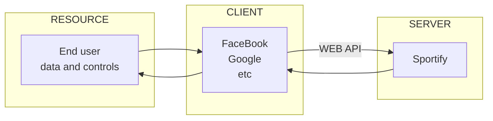



# 符号书写

### 特殊符号语法标记【实体字符】
> 可用于**逻辑学**、**数学**等公式中，[其他详细参考](https://blog.csdn.net/qq_33538554/article/details/86999348){:target='_blank'}
{:.comment}   

| 符号  |  名称  |   页内标记语法   |     范畴     |         读作          |
|:---:|:----:|:----------:|:----------:|:-------------------:|
|  ⇒  | 实质蕴涵 |  `&rArr;`  |    命题逻辑    |     蕴涵；如果.. 那么      |
|  →  | 实质蕴涵 |  `&rarr;`  |    命题逻辑    |     蕴涵；如果.. 那么      |
|  ⊃  | 实质蕴涵 |  `&sup;`   |    命题逻辑    |     蕴涵；如果.. 那么      |
|  ⇔  | 实质等价 |  `&hArr;`  |    命题逻辑    |      当且仅当；iff       |
|  ↔  | 实质等价 |  `&harr;`  |    命题逻辑    |      当且仅当；iff       |
|  ¬  | 逻辑否定 |  `&not;`   |    命题逻辑    |          非          |
|  /  | 命题逻辑 |  `&sol;`   |    命题逻辑    |          非          |
|  ∧  | 逻辑合取 |  `&and;`   |    命题逻辑    |          与          |
|  ∨  | 逻辑析取 |   `&or;`   |    命题逻辑    |          或          |
|  ⊕  | xor  | `&oplus;`  | 命题逻辑, 布尔代数 |         异或          |
|  ⊻  | xor  | `&veebar;` | 命题逻辑, 布尔代数 |         异或          |
|  ∀  | 全称量词 | `&forall;` |    谓词逻辑    | 对于所有； 对于任何；对于每个；任意的 |
|  ∃  | 存在量词 | `&exist;`  |    谓词逻辑    |         存在着         |
| ∃!  | 唯一量词 | `&exist;`！ |    谓词逻辑    |       精确的存在一个       |
|  ≡  |  定义  | `&equiv;`  |    所有地方    |        被定义为         |
| :=  |  定义  |    `:=`    |    所有地方    |        被定义为         |
| :⇔  |  定义  | `:&hArr;`  |    所有地方    |        被定义为         |
| ()  | 优先组合 |    `()`    |    所有地方    |          无          |
|  ├  |  推论  | `&#9500;`  | 命题逻辑, 谓词逻辑 |        推论或推导        |

### 取消特殊符号的功能语法化【实体字符】
> 在符号前加入**反斜杠**\
{:.comment}  

```markdown
\*\*本该加粗却没加粗\*\*
\- 本该成序列却没成序列
```

\*\*本该加粗却没加粗\*\*

\- 本该成序列却没成序列

### 其他实体字符的写法

```
 \[&#10004;\] &rarr; 
```
- \[&#10004;\] &rarr;

# 图片添加

### 弹出式图片(可点击)

```markdown
[{:.border width='600px'}](https://az333960.vo.msecnd.net/images-3/i-thaleia-kai-i-gata-thalia-and-the-cat-odysseas-oikonomoy-2010-2a638ee4.jpg)
```

&emsp;

[{:.border width='500px'}](https://az333960.vo.msecnd.net/images-3/i-thaleia-kai-i-gata-thalia-and-the-cat-odysseas-oikonomoy-2010-2a638ee4.jpg)
&emsp;使用了**`[[图片名称](图片链接)](链接地址)`**的语法


### 调用语法简写
> 声明的意思是可用ID来代替图片的文件路径和网页的文件路径，但原路径是设置在github本地文件里的，考虑到国内访问github图床的速度，慎用。后者路径可能由**category**决定。
{:.comment}  

```markdown

{:width='500px'}
```

- imgpath : {{page.imgpath}}
- pageid : {{page.id}}

### 圆角阴影图片

```markdown
{:.rounded.shadow}
```

&emsp;

{:.border width='500px'}{:.rounded.shadow}
&emsp;**`{:.rounded.shadow}`**分别是圆角与阴影立体
{:.comment}

### 并排图片

```markdown
{:width='420px'}
{:width='420px'} 
```

{:width='420px'}
{:width='420px'}

### 图片描述

```markdown
{:.border width='500px'}  
*[这是图片可点击图片描述](https://useum.org){:target='_blank'}*  

- 需在双空格的图片后,添入带*号的文字
- 图片后若有双空格，文字描述则在下侧显示；否之，在右侧
```

{:.border width='500px'}  
*[这是可点击图片描述](https://useum.org){:target='_blank'}*  

- 需在双空格的图片后,添入带*号的文字
- 图片后若有双空格，文字描述则在下侧显示；否之，在右侧

### 序列中插入图片

1. 这是序列第一号
    - 这是序列一点一

2. 这是序列第二号
    - 这是序列二点二
    - 这是序列二点三
        + 这是序列二点三一
           {:width='600px'}  
        + 这是序列二点三二
            * 这是序列二点三二一
            * 这是序列二点三二二

> 「图片后有双空格，其他无」

# 链接配置

### 链接跳转到新窗口

```markdown
[书格](https://www.shuge.org/){:target='_blank'}
```

链接：[书格](https://www.shuge.org/){:target='_blank'}  

# 样式

### 字体颜色
```markdown
- **蓝色字体**{:.font-blue}  
```

- **蓝色字体**{:.font-blue}  

```markdown
- **红色字体**{:.font-red}  
```

- **红色字体**{:.font-red}  

### 绿色可点击标签

[示例标签](#样式){:.button.button--outline-success.button--pill.button--sm}

### 标题与引用的连用，特殊样式
> "就像现在一样，引用和标题是连起来的"
{:.comment}  

- 只需在引用下添加**{:.comment}**

```markdown
# 标题与引用的连用，特殊样式
> "就像现在一样，引用和标题是连起来的"
{:.comment}  
```

# Sublime插件

### MarkdownEditing快捷键

- 输入 "mdi + tab" 会自动插入下面的图片标记

```markdown

```

- 输入 "mdl + tab" 会自动生成下面的链接标记

```markdown
[](link)
```

### OmniMarkupPreviewer快捷键
- 输入"Command +Option +O"在浏览器中即实预览

### TableEditor表格
- 输入"ctrl + shift + p"打开下方其中一项功能
- "Table Editor: Set table syntax ... for current view"

# 流程图

```markdown
   mermaid
graph LR
    A-->B
    B-->A
    B--WEB API-->C
    C-->B
    subgraph SERVER
    C[Sportify]
    end
    subgraph CLIENT
    B[FaceBook<br/>Google<br/>etc]
    end
    subgraph RESOURCE
    A[End user<br/>data and controls]
    end

```



# 书写样式

### table表格
<table class='mk-table'>
    <tr><th>测试</th><th>测试</th><th>测试</th><th>测试</th></tr>
    <tr><td rowspan='2'>测试测试测试 测试测试</td><td rowspan='2'>测试测试 测试测试 测试</td><td>$z$测试</td><td class='text--left'>测试 测试测试测试测试测试</td></tr>
    <tr><td>测试</td><td class='text--left'>测试</td></tr>
    <tr><td rowspan='2'>测试测试</td><td rowspan='2'>测试测试测试测试</td><td>$x^2$测试</td><td class='text--left'>测试测试测试<br/>测试测试测试</td></tr>
    <tr><td>$F$测试</td><td class='text--left'>두测试测试测试测试测试测试<br/>测试测试测试测试测试测试</td></tr>
    <tr><td>测试测试测试测试</td><td>测试测试测试测试</td><td>$\hat{p}$测试测试</td><td class='text--left'>测试测试测试测试测试</td></tr>
</table>
*测试测试测试测试测试*

### 竖排直书
<div style="writing-mode: vertical-rl;" markdown="1">
我是直排文字

關關雎鳩，在河之洲。

窈窕淑女，君子好逑。
</div>

### 引用脚注
这是一句话加引用上标[^1]

[^1]: 这是引用出处