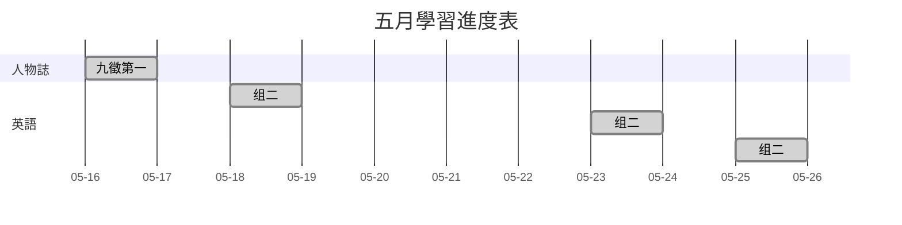

### 五月集  
  
|                                                                           | &emsp;&emsp;&ensp;&emsp;&ensp;五月学习任务目标集合                                                     |                                      |                                           |
|:-------------------------------------------------------------------------:|:---------------------------------------------------------------------------------------------|:------------------------------------:|:-----------------------------------------:|
|                                  **日期**                                   | &emsp;&emsp;&ensp;&emsp;&emsp;&ensp;&emsp;&ensp;**学习内容**                                     |               **学习时间**               |                 **完成情况**                  |
|                                 **0515/**                                 | &ensp;&emsp;&ensp;&emsp;&emsp;&ensp;&emsp;&emsp;&ensp;暂未读 | 无 | 未完成`x` |
| ~~[day1]**0516/**~~&emsp;&emsp;&ensp; | ~~①《人物志》<mark>间注整理</mark>~~                                                                  |            ~~`1小时18分钟`~~             |              &emsp;~~完成`√`~~              |
|                                 **0517/**                                 | &ensp;&emsp;&ensp;&emsp;&emsp;&ensp;&emsp;&emsp;&ensp;暂未读 | 无 | 未完成`x` |
| ~~[day2]**0518/**~~&emsp;&emsp;&ensp; | ~~①英语<mark>组二</mark>~~                                                                       |            ~~`1小时15分钟`~~             |              &emsp;~~完成`√`~~              |
|                                 **0519/**                                 | &ensp;&emsp;&ensp;&emsp;&emsp;&ensp;&emsp;&emsp;&ensp;暂未读 | 无 | 未完成`x` |
|                                 **0520/**                                 | &ensp;&emsp;&ensp;&emsp;&emsp;&ensp;&emsp;&emsp;&ensp;暂未读 | 无 | 未完成`x` |
|                                 **0521/**                                 | &ensp;&emsp;&ensp;&emsp;&emsp;&ensp;&emsp;&emsp;&ensp;暂未读 | 无 | 未完成`x` |
| ~~[day3]**0522/**~~&emsp;&emsp;&ensp; | ~~①讀書~~                                                                                      |            ~~`1小时18分钟`~~             |              &emsp;~~完成`√`~~              |
| ~~[day4]**0523/**~~&emsp;&emsp;&ensp; | ~~①英语<mark>组二</mark>~~                                                                       |            ~~`2小时30分钟`~~             |              &emsp;~~完成`√`~~              |
| ~~[day5]**0524/**~~&emsp;&emsp;&ensp; | ~~①讀書~~                                                                                      |            ~~`1小时33分钟`~~             |              &emsp;~~完成`√`~~              |
| ~~[day6]**0525/**~~&emsp;&emsp;&ensp; | ~~①英语<mark>组二</mark>~~                                                                       |            ~~`1小时00分钟`~~             |              &emsp;~~完成`√`~~              |
| ~~[day7]**0526/**~~&emsp;&emsp;&ensp; | ~~①英语<mark>组二</mark>~~                                                                       |            ~~`1小时08分钟`~~             |              &emsp;~~完成`√`~~              |

  
